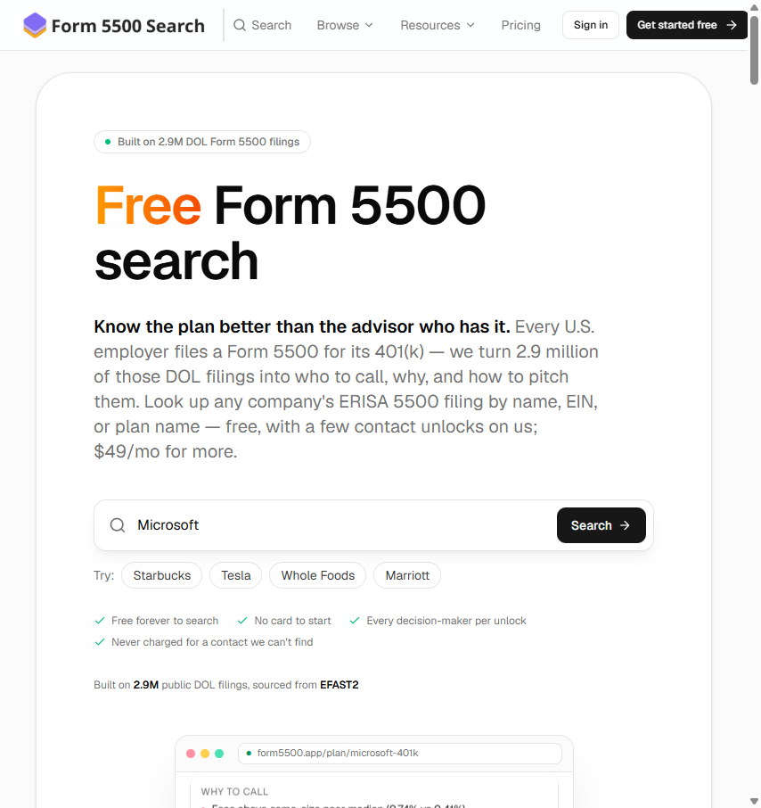

# Form 5500 Search

**Live at [form5500search.com](https://form5500search.com)**

A free search engine over ~2.9 million U.S. Department of Labor Form 5500 filings — the annual reports every employee benefit plan (401(k), pension, welfare) files under ERISA. Built for financial advisors prospecting retirement plans.

## What it does

- **Search 2.9M filings** by company name, EIN, or plan name — free, no account required
- **Plan intelligence**: every plan gets a 0–100 health score, fee benchmarks vs. same-size peers, the full provider stack (recordkeeper, custodian, auditor, advisor), and year-over-year change detection
- **Fund holdings**: parses the Schedule of Assets out of each filing, so you can see every line item a plan owns — and reverse-lookup every plan holding a given fund family, ranked by dollars
- **Lead reports**: curated lists of plans that just changed recordkeeper or auditor, lost assets, or pay above-median fees — the highest-signal prospecting triggers
- **Decision-maker unlocks**: verified contacts (signer, CFO, HR, benefits) with email and LinkedIn, exportable to CSV
- **Programmatic SEO**: hundreds of thousands of indexable plan, company, provider, fund, state, and industry pages

## How it's built

- **Next.js (App Router)** serving a corpus of Parquet files queried in-process with **DuckDB** — no database server; the entire dataset is baked into the Docker image
- **Data pipeline**: monthly automated refresh from DOL EFAST2 (download, convert, canonicalize), plus a PDF-parsing pipeline (Gemini + Docling) that extracts itemized holdings from scanned Schedule H attachments
- **Supabase** for auth and billing state, **Stripe** for payments, **Railway** for hosting, **Cloudflare** for edge caching of SEO pages
- Fully automated deploys: GitHub Actions rebuilds the data, bakes a new image, deploys, purges the edge cache, pings IndexNow, and warms every hub page

*The source code is private. This repo is a project showcase.*
